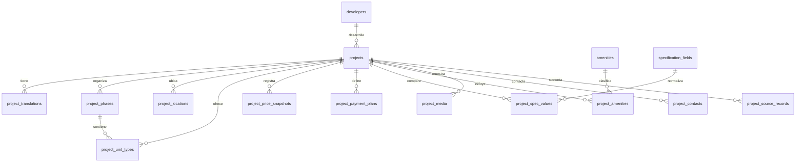

# Mapa de base de datos para CMS de proyectos inmobiliarios

Este documento define el modelo de datos recomendado para un manejador de contenido enfocado solo en proyectos, datos comerciales y especificaciones comparables. La base debe permitir alimentar tarjetas, fichas, filtros, mapa, comparativas y formularios sin duplicar información ni inventar campos en la interfaz.

La regla principal es separar el dato real de su presentación. Si un dato no está documentado, se guarda con estado editorial y la vista pública decide si lo omite, lo deja vacío, muestra una raya o invita a consultar. No se debe publicar “datos confirmados”, “por confirmar” ni textos internos similares como parte de la experiencia comercial.

## Principios del modelo

1. El proyecto es la entidad principal.
2. Los textos públicos viven por idioma para soportar `es`, `en` y `fr`.
3. Los números se guardan como números: precios, áreas, distancias, porcentajes, habitaciones, baños y coordenadas.
4. Cada dato comparable tiene estado de evidencia: `documented`, `pending`, `varies`, `not_applicable` o `archived`.
5. Todo dato sensible para inversión debe poder apuntar a una fuente: brochure, ficha, conversación aprobada, enlace oficial o documento del desarrollador.
6. La estructura debe servir a varias vistas: listado, ficha, mapa 3D, filtros, tabla comparativa y matriz de amenidades.
7. Las claves privadas, tokens y credenciales de integraciones nunca deben vivir en tablas de contenido.

## Relación general

## Entidades

### `projects`

Registro maestro del proyecto. Debe existir aunque aún no esté publicado.

| Campo | Tipo sugerido | Uso |
| --- | --- | --- |
| `id` | text/uuid | Identificador interno estable. |
| `slug` | text único | URL pública y referencia de CMS. |
| `name` | text | Nombre aprobado del proyecto. |
| `developer_id` | fk opcional | Desarrollador responsable. |
| `public_status` | enum | `draft`, `review`, `published`, `archived`. |
| `sales_status` | enum | `preventa`, `construccion`, `terminado`, `agotado`, `consultar`. |
| `property_category` | enum | `apartamento`, `villa`, `townhouse`, `penthouse`, `mixto`, `otro`. |
| `sector` | text | Sector o zona comercial, por ejemplo Vista Cana. |
| `city` | text | Ciudad o polo inmobiliario. |
| `province` | text | Provincia. |
| `country` | text | País. |
| `is_featured` | boolean | Destacado en home/listado. |
| `sort_order` | integer | Orden editorial. |
| `published_at` | datetime | Fecha de publicación. |
| `created_at`, `updated_at` | datetime | Auditoría. |

### `project_translations`

Textos por idioma.

| Campo | Tipo sugerido | Uso |
| --- | --- | --- |
| `project_id` | fk | Proyecto. |
| `locale` | enum | `es`, `en`, `fr`. |
| `headline` | text | Titular corto para ficha o hero. |
| `summary` | text | Resumen para tarjeta. |
| `description` | text | Descripción amplia. |
| `investment_note` | text | Nota comercial aprobada. |
| `location_note` | text | Descripción de entorno. |
| `seo_title`, `seo_description` | text | SEO por idioma. |

### `developers`

Desarrolladores o promotores. Solo se completa con información aprobada.

| Campo | Tipo sugerido | Uso |
| --- | --- | --- |
| `name` | text | Nombre público. |
| `legal_name` | text opcional | Razón social si aplica. |
| `website_url` | text opcional | Sitio oficial. |
| `contact_email`, `contact_phone` | text opcional | Contacto comercial documentado. |
| `description` | text opcional | Trayectoria aprobada. |

### `project_phases`

Etapas o fases del proyecto.

| Campo | Tipo sugerido | Uso |
| --- | --- | --- |
| `project_id` | fk | Proyecto. |
| `name` | text | Nombre de fase/etapa. |
| `delivery_date` | date opcional | Fecha exacta si existe. |
| `delivery_year` | integer opcional | Filtro por 2026, 2027, 2028, 2029, 2030. |
| `status` | enum | `preventa`, `construccion`, `entregado`, `consultar`. |
| `source_status` | enum | Estado de evidencia. |
| `notes` | text | Aclaración interna/editorial. |

### `project_unit_types`

Tipologías comercializables.

| Campo | Tipo sugerido | Uso |
| --- | --- | --- |
| `project_id` | fk | Proyecto. |
| `phase_id` | fk opcional | Fase si aplica. |
| `name` | text | Tipo A, 1 habitación, villa, penthouse, etc. |
| `property_type` | enum | Apartamento, villa, townhouse, penthouse. |
| `bedrooms_min`, `bedrooms_max` | numeric | Habitaciones. |
| `bathrooms_min`, `bathrooms_max` | numeric | Baños. |
| `area_min_m2`, `area_max_m2` | numeric | Metraje. |
| `parking_min`, `parking_max` | numeric | Parqueos. |
| `furnished_status` | enum | `yes`, `no`, `optional`, `unknown`. |
| `availability_status` | enum | `available`, `limited`, `sold_out`, `consult`. |
| `source_status` | enum | Estado de evidencia. |

### `project_price_snapshots`

Historial de precios y reservas. No se debe sobrescribir el precio anterior sin dejar trazabilidad.

| Campo | Tipo sugerido | Uso |
| --- | --- | --- |
| `project_id` | fk | Proyecto. |
| `unit_type_id` | fk opcional | Tipología. |
| `currency` | text | USD, DOP, EUR. |
| `price_from` | numeric | Precio desde. |
| `price_to` | numeric opcional | Precio hasta si existe. |
| `reservation_amount` | numeric opcional | Monto de separación/reserva. |
| `effective_from`, `effective_to` | date | Vigencia. |
| `source_status` | enum | Estado de evidencia. |
| `source_record_id` | fk opcional | Documento o evidencia. |

### `project_payment_plans`

Planes de pago por proyecto, fase o tipología.

| Campo | Tipo sugerido | Uso |
| --- | --- | --- |
| `project_id` | fk | Proyecto. |
| `phase_id`, `unit_type_id` | fk opcional | Alcance del plan. |
| `initial_percent` | numeric opcional | Inicial. |
| `during_construction_percent` | numeric opcional | Durante construcción. |
| `on_delivery_percent` | numeric opcional | Contra entrega. |
| `reservation_amount` | numeric opcional | Reserva vinculada. |
| `description` | text | Texto aprobado del plan. |
| `source_status` | enum | Estado de evidencia. |

### `specification_fields`

Catálogo de campos comparables. Evita que cada proyecto invente nombres distintos.

| Campo | Tipo sugerido | Uso |
| --- | --- | --- |
| `key` | text único | `price_from`, `beach_distance`, `roi_estimated`, etc. |
| `label_es`, `label_en`, `label_fr` | text | Etiqueta pública. |
| `group_key` | enum | `investment`, `space`, `location`, `operation`, `amenities`, `legal`. |
| `data_type` | enum | `text`, `number`, `money`, `percent`, `distance`, `date`, `boolean`, `enum`. |
| `unit` | text opcional | m², min, %, USD. |
| `is_filterable` | boolean | Puede alimentar filtros. |
| `is_comparable` | boolean | Aparece en comparativa. |
| `display_order` | integer | Orden público. |

### `project_spec_values`

Valores comparables por proyecto. Es la tabla central para la comparativa inteligente.

| Campo | Tipo sugerido | Uso |
| --- | --- | --- |
| `project_id` | fk | Proyecto. |
| `field_id` | fk | Campo normalizado. |
| `phase_id`, `unit_type_id` | fk opcional | Aplica a fase/tipología específica. |
| `value_text` | text opcional | Texto aprobado. |
| `value_number` | numeric opcional | Número comparable. |
| `value_boolean` | boolean opcional | Sí/no. |
| `value_date` | date opcional | Fecha. |
| `value_json` | json opcional | Rangos u opciones múltiples. |
| `source_status` | enum | Estado de evidencia. |
| `source_record_id` | fk opcional | Evidencia. |
| `public_note` | text opcional | Aclaración visible si ayuda a decidir. |
| `internal_note` | text opcional | Nota para edición, no pública. |

### `amenities` y `project_amenities`

Amenidades normalizadas para filtros y checklist comparativo.

| Tabla | Campos clave | Uso |
| --- | --- | --- |
| `amenities` | `key`, etiquetas, categoría, icono, orden | Catálogo único: piscina, gimnasio, golf, pádel, playa artificial, etc. |
| `project_amenities` | `project_id`, `amenity_id`, `availability`, `source_status`, `note` | Marca si el proyecto lo incluye, no aplica o depende de fase. |

### `project_locations`

Datos para mapa 2D/3D y filtros geográficos.

| Campo | Tipo sugerido | Uso |
| --- | --- | --- |
| `project_id` | fk | Proyecto. |
| `latitude`, `longitude` | numeric | Coordenadas. |
| `map_label` | text | Nombre en mapa. |
| `address_public` | text | Dirección pública o zona. |
| `sector`, `city`, `province`, `country` | text | Filtros. |
| `distance_to_beach_minutes` | numeric opcional | Filtro playa. |
| `distance_to_airport_minutes` | numeric opcional | Filtro aeropuerto. |
| `source_status` | enum | Estado de evidencia. |

### `project_media`

Imágenes, renders, planos y videos.

| Campo | Tipo sugerido | Uso |
| --- | --- | --- |
| `project_id` | fk | Proyecto. |
| `media_type` | enum | `hero`, `gallery`, `floor_plan`, `map`, `video`, `document`. |
| `url` | text | Ruta pública o asset. |
| `alt_text` | text | Accesibilidad. |
| `caption` | text opcional | Pie de imagen. |
| `sort_order` | integer | Orden. |
| `rights_status` | enum | `owned`, `developer_provided`, `licensed`, `unknown`. |
| `is_public` | boolean | Puede publicarse. |

### `project_contacts`

Contactos relacionados al proyecto. Útil para CMS y operación, no necesariamente todo es público.

| Campo | Tipo sugerido | Uso |
| --- | --- | --- |
| `project_id` | fk | Proyecto. |
| `contact_type` | enum | `sales`, `developer`, `broker`, `support`, `internal`. |
| `name` | text opcional | Nombre. |
| `phone`, `email`, `whatsapp` | text opcional | Datos de contacto. |
| `is_public` | boolean | Si se muestra al usuario. |
| `notes` | text opcional | Nota interna. |

### `project_source_records`

Registro de evidencia.

| Campo | Tipo sugerido | Uso |
| --- | --- | --- |
| `project_id` | fk | Proyecto. |
| `source_type` | enum | `brochure`, `developer_message`, `website`, `price_list`, `contract`, `manual_note`. |
| `title` | text | Nombre de la fuente. |
| `url` | text opcional | Enlace si aplica. |
| `file_path` | text opcional | Archivo interno. |
| `received_at` | datetime | Fecha de recepción. |
| `verified_at` | datetime opcional | Fecha de revisión. |
| `verified_by` | text opcional | Responsable. |

## Campos mínimos para publicar un proyecto

| Campo | Condición |
| --- | --- |
| Nombre aprobado y `slug` | Obligatorio. |
| Estado público | Debe ser `published`. |
| Ubicación general | Ciudad/sector/país obligatorios. Coordenadas recomendadas. |
| Imagen principal | Obligatoria con derechos revisados. |
| Texto en español | Titular, resumen y descripción mínima. |
| Tipo de propiedad | Obligatorio si alimenta filtros. |
| Habitaciones o tipologías | Obligatorio para comparar. |
| Estado/fecha de entrega | Obligatorio como dato documentado, variable o consulta. |
| Precio/reserva/plan de pago | Recomendado; solo filtra si está documentado. |
| Amenidades | Solo se muestran con evidencia o como no aplican. |

## Estados editoriales y salida pública

| Estado | Significado interno | Salida pública recomendada |
| --- | --- | --- |
| `documented` | Existe evidencia revisada. | Mostrar valor. |
| `pending` | Falta evidencia. | Omitir, dejar vacío, raya o CTA “Consultar”. |
| `varies` | Depende de fase, unidad o vigencia. | Mostrar rango o “según fase/unidad” con el valor disponible. |
| `not_applicable` | Revisado y no aplica. | Omitir o mostrar raya en checklist. |
| `archived` | Dato viejo. | No mostrar. |

## Flujo del CMS

1. Crear proyecto en borrador.
2. Cargar fuentes aprobadas.
3. Completar textos por idioma.
4. Registrar ubicación y coordenadas.
5. Crear fases/etapas.
6. Crear tipologías.
7. Registrar precio vigente y reserva como snapshot.
8. Registrar plan de pago.
9. Completar especificaciones comparables.
10. Asociar amenidades desde catálogo.
11. Asociar media con estado de derechos.
12. Revisar campos mínimos y publicar.

## Mapeo desde el contenido actual

| Fuente actual | Tabla destino |
| --- | --- |
| `app/src/content/projects.ts` id, slug, name, status, featured | `projects` |
| Descripciones y copy público | `project_translations` |
| Ubicación, coordenadas, referencias de mapa | `project_locations` |
| Habitaciones, baños, metraje, parqueos, appliances | `project_unit_types` y `project_spec_values` |
| Precio desde y reserva | `project_price_snapshots` |
| Plan de pago | `project_payment_plans` |
| Amenidades | `amenities` y `project_amenities` |
| Hero, galería, renders y planos | `project_media` |
| `app/src/content/project-information.ts` | `specification_fields` y `project_spec_values` |
| Campo `source` o documento de origen | `project_source_records` |

## Información que falta solicitar para completar el CMS

- Lista de precios por proyecto, fase y tipología, con vigencia.
- Inventario disponible por fase/tipología.
- Planos con baños, parqueos, metros y distribución.
- Fecha de entrega por fase.
- Cuota de mantenimiento.
- Datos documentados del desarrollador.
- Política de renta vacacional y administración Airbnb.
- Condiciones de financiamiento.
- Beneficios fiscales o CONFOTUR si aplican.
- Amenidades exactas por fase.
- Brochures oficiales, listas de precios y enlaces verificables.

## Regla para comparativa inteligente

La comparativa debe usar `specification_fields` como filas y proyectos como columnas. Para campos booleanos o amenidades se muestra checklist. Para números se puede ordenar o resaltar el mejor valor solo cuando todos los proyectos comparados tengan datos documentados y comparables. Si falta evidencia, la celda se deja neutra y no participa en recomendaciones automáticas.
